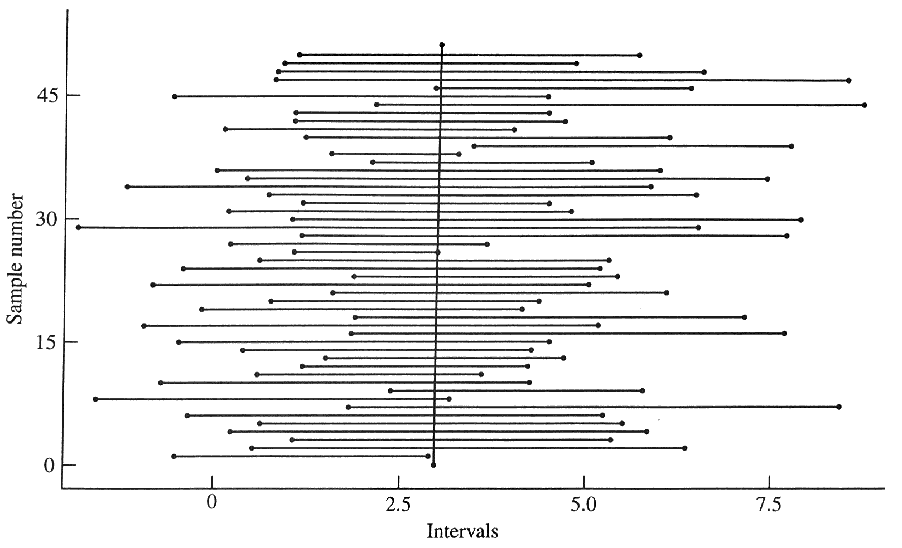

```{r setup, include=FALSE}
knitr::opts_chunk$set(echo = TRUE)
library(ggplot2)
knitr::opts_chunk$set(fig.align = "center")
```

# Lecture 1 {.unnumbered}

## Outline

- Sampling weight
- Confidence intervals
- Sample size estimation

## Sampling Weight

Recall the **inclusion probability** $\pi_i=P(\text{unit }i\text{ in sample})$.

<br>

The *sampling weight* is the reciprocal of the inclusion probability:

$$w_i=\frac{1}{\pi_i}$$	

It can be interpreted as the number of population units represented by unit $i$.

---

## Sampling Weight

For a SRS:

- Each unit has inclusion probability $\pi_i=n/N$
- All sampling weights are $w_i=N/n$	
- $\sum_{i\in\mathcal{S}}w_i=N$

<br>

Because all sampling weights are the same in a SRS, we call it a *self-weighting* sample.

---

## Sampling Weight

Estimators can also be written using sampling weights:

$$\hat{t}=\sum_{i\in\mathcal{S}}w_iy_i$$	

---
class: middle center

# Confidence Intervals

---

## Review

Last time, saw how to estimate population 

- means
- totals
- proportions 

for SRS and how to find the standard error of these estimates.

---

## Review

Let $y_i$ be the numeric response from the $i$th member of the population.

What you want to estimate | Formula | Estimator | Standard Error
- | - | - | -
Pop total | $t=\sum\limits_{i=1}^N y_i$ | $\hat{t}=N\bar{y}$ | $N\sqrt{\left(1-\frac{n}{N}\right)\frac{s^2}{n}}$
Pop mean | $\bar{y}_\mathcal{U}=\frac{1}{N}\sum\limits_{i=1}^N y_i$ | $\bar{y}$ | $\sqrt{\left(1-\frac{n}{N}\right)\frac{s^2}{n}}$
Pop proportion | $p=\frac{1}{N}\sum\limits_{i=1}^N\mathbb{1}(y_i=\text{ char})$ | $\hat{p}$  | $\sqrt{\left( 1-\frac{n}{N}\right)\frac{\hat{p}(1-\hat{p})}{n-1}}$ 	
	
---

## Review

We've also talked about how *accurate* an estimate is.


- A is *unbiased* but has *high* variance.
- B is *biased* but has *low* variance.
- C is both *unbiased* and has *low* variance (lower *MSE* than others).

---

## Confidence Intervals

*Confidence intervals* (*CIs*) are used to indicate the accuracy of an estimate. They are relative to a particular percent:

<br>

For a $95\%$ CI: 

- If we took samples over and over again from the population and constructed a confidence interval for *each* possible sample, $95\%$ of the resulting intervals would include the true value of the population parameter.

---

## Confidence Intervals





---

## Central Limit Theorem

In intro stat classes, you relied on **asymptotic** results to construct confidence intervals for an unknown mean $\mu$.

<br>

The *central limit theorem* says that for a random sample with replacement, the probability distribution of $\sqrt{n}(\bar{y}-\mu)$ converges to a **normal distribution** with mean 0 and variance $\sigma^2$ *as the sample size $n$ approaches infinity*.

<br>

However, in most sample surveys, we have a *finite population* and we are sampling *without replacement*.

---

## Central Limit Theorem for a SRS

To use asymptotic results, assume that the population is part of a larger *superpopulation*. Hájek (1960) proved a central limit theorem for simple random sampling without replacement. 

<br>

Under certain technical conditions and if $n$, $N$, and $N-n$ are all sufficiently large, then the sampling distribution of $$\frac{\bar{y}-\bar{y}_\mathcal{U}}{\sqrt{\left(1-\frac{n}{N}\right)\frac{S^2}{n}}}$$ is approximately normal (Gaussian) with mean 0 and variance 1.

---

## Confidence Intervals

A large-sample $100(1-\alpha)\%$ CI for the population mean is then

<br>

$$\begin{equation*}
\left[\bar{y}-z_{\alpha/2}\sqrt{\left(1-\frac{n}{N}\right)\frac{S^2}{n}},\,\, \bar{y}+z_{\alpha/2}\sqrt{\left(1-\frac{n}{N}\right)\frac{S^2}{n}}\right]
\end{equation*}$$

<br>

where $z_{\alpha/2}$ is the $(1-\alpha/2)$th percentile of the standard normal distribution.

<br>

- For a $95\%$ CI, $\alpha=0.05$ and $z_{0.025}=1.96$.

---

## Confidence Intervals

Because $S^2$ is often unknown and we need to approximate it by $s^2$, for large samples a $95\%$ CI is

<br>

$$\begin{equation*}
\left[\bar{y}-t_{\alpha/2,n-1}\text{SE}(\bar{y}),\,\, \bar{y}+t_{\alpha/2,n-1}\text{SE}(\bar{y})\right]
\end{equation*}$$

<br>

where $t_{\alpha/2,n-1}$ is the $(1-\alpha/2)$th percentile of the $t$ distribution with $n-1$ degrees of freedom and $\text{SE}(\bar{y})=\sqrt{\left(1-\frac{n}{N}\right)\frac{s^2}{n}}$.

<br>

- For large samples, $z_{\alpha/2}\approx t_{\alpha/2,n-1}$.
- For small samples, probably shouldn't be making CIs.
- Using the $t$ distribution will give slightly wider intervals, so it may be a more "conservative" estimate.

---

## When to use Confidence Intervals

What does "sufficiently large" $n$, $N$, and $N-n$ mean?

- "Magic number" $n = 30$ often does not suffice for finite populations
- If the $y_i$ come from something resembling a normal distribution, it's probably safe to use the CLT with sample sizes as small as 50 to obtain CI for $\bar{y}_\mathcal{U}$
- If the $y_i$ come from a skewed distribution, $n$ may need to be larger to obtain a valid CI

---

## Confidence Intervals

Confidence intervals for population totals and proportions are found in the same way. 

<br>

A $100(1-\alpha)\%$ CI is

$$\text{estimate} \pm z_{\alpha/2} \text{SE(estimate)}$$	

---

## Example - Revisiting Swiss Municipalities

Recall we looked at the sampling distribution for the total area cultivated. This was many SRS of size $100$ from a population of size $2896$.

<br>

```{r echo=FALSE, fig.height=5, fig.width=10, message=FALSE, warning=FALSE, out.width='600px', dpi=300, fig.align="center"}
library(sampling)
data(swissmunicipalities)
library(ggplot2)
library(gridExtra)

areacult <- swissmunicipalities$Surfacescult	# area under cultivation
N <- length(areacult)

# True population parameter
t <- sum(areacult)

### Draw a LARGER sample
n <- 100

## Let's draw many MANY more samples
t.hat <- rep(0, 100000)
for (i in 1:100000) {
	samp.new <- srswor(n, N)
	t.hat[i] <- N * mean(areacult[samp.new == 1])
}

df <- data.frame(t.hat)

p1 <- ggplot(swissmunicipalities, aes(x=areacult)) + 
  geom_histogram(fill="#43418A") + 
  theme_bw() +
  labs(x="Area Cultivated in Municipality") +
  ggtitle("Population")

p2 <- ggplot(df, aes(x=t.hat)) +
  geom_histogram(fill="#43418A") +
  geom_vline(xintercept=t, col="#D73F09") +
  theme_bw() +
  labs(x="Estimate of Total Area Cultivated") +
  ggtitle("Sampling Distribution of Total Area Cultivated\nFrom 100,000 Samples of Size 100")

grid.arrange(p1, p2, ncol=2)
```

---

## Example - Revisiting Swiss Municipalities

What if we drew a smaller sample? Say $n=5$.

<br>

```{r echo=FALSE, fig.height=5, fig.width=5, message=FALSE, warning=FALSE, out.width='300px', dpi=300, fig.align="center"}
### Draw a SMALL sample
n <- 5

## Let's draw many MANY more samples
t.hat5 <- rep(0, 100000)
for (i in 1:100000) {
	samp.new <- srswor(n, N)
	t.hat5[i] <- N * mean(areacult[samp.new == 1])
}

df$t.hat5 <- t.hat5

ggplot(df, aes(x=t.hat5)) +
  geom_histogram(fill="#43418A") +
  geom_vline(xintercept=t, col="#D73F09") +
  theme_bw() +
  labs(x="Estimate of Total Area Cultivated") +
  ggtitle("Sampling Distribution of Total Area Cultivated\nFrom 100,000 Samples of Size 5")
```

---

## Example - Revisiting Swiss Municipalities

What if we used $n=100$, but looked at a variable that was even more skewed? Perhaps the total area with buildings in each municipality, `areabuild`:

<br>

```{r echo=FALSE, fig.height=5, fig.width=10, message=FALSE, warning=FALSE, out.width='600px', dpi=300, fig.align="center"}
## Variable that's MORE SKEWED
areabuild <- swissmunicipalities$Airbat
t <- sum(areabuild)
n <- 100

## Let's draw many MANY more samples
t.hat2 <- rep(0, 100000)
for (i in 1:100000) {
	samp.new <- srswor(n, N)
	t.hat2[i] <- N * mean(areabuild[samp.new == 1])
}

df$t.hat2 <- t.hat2

p3 <- ggplot(swissmunicipalities, aes(x=areabuild)) + 
  geom_histogram(fill="#43418A") + 
  theme_bw() +
  labs(x="Area with Buildings in Municipality") +
  ggtitle("Population")

p4 <- ggplot(df, aes(x=t.hat2)) +
  geom_histogram(fill="#43418A") +
  geom_vline(xintercept=t, col="#D73F09") +
  theme_bw() +
  labs(x="Estimate of Total Area with Buildings") +
  ggtitle("Sampling Distribution of Total Area with Buildings\nFrom 100,000 Samples of Size 100")

grid.arrange(p3, p4, ncol=2)
```

---

## Example - Revisiting Swiss Municipalities

Now suppose $n=500$ and return to estimating total area cultivated. Let's draw 100,000 samples and use each to calculate a CI for the population total. The CIs for the first 100 of those samples are shown below:

```{r echo=FALSE, fig.height=5, fig.width=10, message=FALSE, warning=FALSE, out.width='600px', dpi=300, fig.align="center"}
### Let's make many 95% CI for the area cultivated example with n=500

n <- 500
N <- length(areacult)
t <- sum(areacult)

z95 <- qnorm(0.975)

t.hat <- rep(0, 100000)
se.est <- rep(0, 100000)
for (i in 1:100000) {
	samp.new <- srswor(n, N)
	t.hat[i] <- N * mean(areacult[samp.new == 1])
	se.est[i] <- N*sqrt((1-n/N)*var(areacult[samp.new == 1])/n)
}

low.bound <- t.hat - z95*se.est
high.bound <- t.hat + z95*se.est

# Plot a smaller number of samples
low.bound.red <- low.bound[1:100]
high.bound.red <- high.bound[1:100]

dci <- data.frame(ind=1:100, low.bound.red, high.bound.red)

ggplot(dci) +
  geom_segment(aes(x=ind, xend=ind, y=low.bound.red, yend=high.bound.red), col="#43418A") +
  geom_hline(yintercept=t, col="#D73F09") +
  theme_bw() +
  labs(x="Sample Number", y="Total Area Cultivated") +
  ggtitle("100 95% Confidence Intervals")
```

---

## Example - Revisiting Swiss Municipalities

We can also calculate how many of those 100,000 intervals contain the true population total area cultivated, `r t`.

<br> 

```{r echo=FALSE}
# With full number of samples, how many contain t?
contain.t <- ifelse(t >= low.bound & t <= high.bound, 1, 0)
sum(contain.t) / 100000
```

---

## Example - Children's Age at Walking

*Lohr 2.13.15*: SRS of 240 children who visited a pediatric outpatient clinic. The frequency distribution for age (in months) of unassisted walking among the children:

<br>


Age (months) | 9 | 10 | 11 | 12 | 13 | 14 | 15 | 16 | 17 | 18 | 19 | 20
- | -
Number of Children | 13 | 35 | 44 | 69 | 36 | 24 | 7 | 3 | 2 | 5 | 1 | 1

<br>

> Construct a histogram of age at walking. Is the shape normally distributed? Do you think the sampling distribution of the sampling average will be normally distributed?

---

## Example - Children's Age at Walking

```{r echo=TRUE, fig.width=3, fig.height=2.5, fig.align="center", out.width='300px', dpi=300, fig.alt="Histogram of age at children's first walking. Values are integers and range from 9 to 20 i, with a peak at 12 and a longer right tail of the distribution."}
walkage <- data.frame(age=c(rep(9,13), rep(10,35), rep(11,44), rep(12,69), 
                            rep(13,36), rep(14,24), rep(15,7), rep(16,3),
                            rep(17,2), rep(18,5), rep(19,1), rep(20,1)))

library(ggplot2)

ggplot(walkage, aes(x=age)) + 
  geom_histogram(binwidth=1, color="white", fill="#43418A") +
  theme_bw() +
  labs(x="Age (months)", title="Histogram of Age at Walking")
```


---

## Example - Children's Age at Walking

> Find the mean, SE, and a $95\%$ CI for the average age for onset of free walking.

$$\begin{align*}
\bar{y}&= \frac{1}{n}\sum_{i=1}^{240} y_i = 12.0792	\\
\text{SE}(\bar{y})&=\sqrt{\left(1-\frac{n}{N}\right)\frac{s^2}{n}} \approx \sqrt{\frac{s^2}{n}} \\
	&= \sqrt{\frac{3.7050}{240}} \\
	&= 0.1242
\end{align*}$$

A $95\%$ CI for the average age is $12.0792 \pm 1.96(0.1242) = [11.8356, 12.3227]$.

---
class: middle center

# Sample Size Estimation

---

## Sample Size Estimation

Samples can be expensive to implement, so in practice it may be important to find the minimum sample size needed to guarantee a certain level of precision.

<br>

These are calculations done *before* the sample is conducted.

---

## How Precise?

For an estimate $\hat{\theta}$ of the population value $\theta$, if $\hat{\theta}$ is unbiased and normally distributed:

$$P\left( \frac{|\hat{\theta}-\theta|}{\sqrt{V(\hat{\theta})}} > z_{\alpha/2}\right)=P\left(|\hat{\theta}-\theta|>\underbrace{z_{\alpha/2}\sqrt{V(\hat{\theta})}}_{e}\right)=\alpha$$

<br>

The *margin of error* $e$ of an estimate $\hat{\theta}$ is the half-width of the CI, that is $z_{\alpha/2}\times \text{SE}(\hat{\theta})$.

- The desired precision is $P(|\hat{\theta}-\theta|\leq e)=1-\alpha$
- Common values *when measuring proportions* are $e=0.03$ and $\alpha=0.05$.

---

## Sample Size Estimation

When estimating the sample mean, the margin of error is

$$e=z_{\alpha/2}\sqrt{\left(1-\frac{n}{N}\right)\frac{S^2}{n}}$$

Solving for $n$ gives $$n=\frac{z_{\alpha/2}^2S^2}{e^2+\frac{z_{\alpha/2}^2S^2}{N}}$$

---

## When $S^2$ is Unknown

$S^2$ may be unknown, but for large populations **where we want to estimate a proportion**, use $S^2\approx p(1-p)$.

<br>

$p(1-p)$ has the largest value when $p=0.5$, so it is common to use this as a "worst case scenario."

---

## Example

Suppose we want to estimate the proportion of recipes in the *Better Homes & Gardens New Cook Book* that do not involve animal products. There are $N=1251$ recipes in the book. 

> How large a SRS should we take to get a $95\%$ CI with margin of error 0.03?

$$\begin{align*}
	n &= \frac{z_{\alpha/2}^2S^2}{e^2+\frac{z_{\alpha/2}^2S^2}{N}} \\
	&= \frac{(1.96)^2(0.5)(1-0.5)}{(0.03)^2+ \frac{(1.96)^2(0.5)(1-0.5)}{1251}} \\
	&= 575.88
\end{align*}$$

<br>

So we need a sample of at least $n=576$.

---

## Example

> How large a SRS should be taken to get a $68\%$ CI with margin of error 0.05?

$$\begin{align*}
	n &= \frac{z_{\alpha/2}^2S^2}{e^2+\frac{z_{\alpha/2}^2S^2}{N}} \\
	&= \frac{(1)^2(0.5)(1-0.5)}{(0.05)^2+ \frac{(1)^2(0.5)(1-0.5)}{1251}} \\
	&= 92.60
\end{align*}$$

<br>

So we need a sample of at least $n=93$.

---

## Simplified Sample Size Estimation

There may be cases where we don't use the finite population correction:

- If $N$ is very large with respect to $n$, the fpc $\approx 1$ 
  - This is because $(1-\frac{n}{N}) \approx (1-0)$ in this case
- If $N$ is unknown, we can do this out of necessity (while understanding the variance of the estimator may be too large)
- With replacement sampling

Then a simplified sample size estimate can be used:

$$\begin{align*}
e&=z_{\alpha/2}\sqrt{\frac{S^2}{n}} \\
n_0&=\left(\frac{z_{\alpha/2}S}{e}\right)^2
\end{align*}$$

---

## A Couple Quick Clarifications

$$e=z_{\alpha/2}\sqrt{\frac{S^2}{n}}$$

- When $n$ is fixed, increasing the percent confidence (decreasing $\alpha$) creates wider intervals (larger margin of error). More of the intervals need to contain the true parameter, so they need to be wider.
- When the percent confidence is fixed, increasing $n$ decreases the SE and thus creates narrower intervals (smaller margin of error).
- Two concepts: 
    - how wide the intervals are ( $e$ ) 
    - how many of the intervals contain the true population value under repeated sampling (percent confidence)
- Ideally, we want narrow intervals and high percent confidence.
- When doing sample size estimation, there is a trade-off because narrow intervals with high percent confidence require large samples.

---

## A Couple Quick Clarifications

Let $S^2=100$ and say $n<<N$ so fpc $\approx 1$. We're estimating a mean. 

> What is $e$ (half-width of CI) for different sample sizes and confidence levels?

Remember, $e=z_{\alpha/2}\sqrt{\frac{S^2}{n}}$.

<br>


| 68% | 95% | 99% 
- | -
100 | 1 | 2 | 3
400 | 0.5 | 1 | 1.5
900 | 0.33 | 0.67 | 1

---

## Estimating $S^2$

If $S^2$ is unknown and we are *not* estimating a proportion, $S^2$ can be approximated using a pilot sample, or from data from previous studies or available in the literature.	

---

## Example - Children's Age at Walking

*Lohr 2.13.15*: SRS of 240 children who visited a pediatric outpatient clinic. The frequency distribution for age (in months) of unassisted walking among the children:

<br>

Age (months) | 9 | 10 | 11 | 12 | 13 | 14 | 15 | 16 | 17 | 18 | 19 | 20
- | -
Number of Children | 13 | 35 | 44 | 69 | 36 | 24 | 7 | 3 | 2 | 5 | 1 | 1

<br>

Suppose the researchers want to do another study in a different region, and wanted a $95\%$ CI for the mean age of onset of walking to have margin of error 0.5. 

> Using the estimated standard deviation for these data, what sample size would they need to take?

---

## Example - Children's Age at Walking

$$\begin{align*}
	n &= \left(\frac{z_{\alpha/2}S}{e}\right)^2 \\
	&= \left(\frac{(1.96)(\sqrt{3.705})}{0.5}\right)^2 \\
	&= 56.93
\end{align*}$$

<br>

So we need a sample of at least $n=57$.


# Lecture 2 {.unnumbered}

## Outline

- Introduction
- Notation
- Estimators

---
class: middle center

# Introduction

---

## Introduction

If the variable of interest takes on different mean values in different subpopulations, then more precise estimates may be obtained by taking a **stratified sample**.

<br>

The subpopulations are called *strata*.

<br>

Draw an independent probability sample from each stratum, then pool the information to obtain overall population estimates. If the samples from each stratum are SRS, then we are doing *stratified random sampling*.

---

## Strata

The strata

- Do not overlap
- Constitute the whole population

<br>

This means that each unit belongs to *exactly one* stratum.

<br>

Strata membership must be known for every individual in the population.

<br>

A pre-specified number of observations from each stratum end up in the sample, rather than allowing the distribution across strata to be random.

---

## Example - Oregon Lakes

We want to estimate the pH of lakes in Oregon.


{width="75%"}

---

## Example - Oregon Lakes

We want to estimate the pH of lakes in Oregon.

<br>

We have classified lakes into three groups based on size:

- Small ( $<1$ hectare)
- Medium (between $1$ and $5$ hectares)
- Large ( $>5$ hectares)	
	
<br>

Practical issues we are aware of:

- There are many more small lakes than large lakes.
- pH is associated with elevation. Small lakes and lakes with lower pH tend to be at higher elevations.
- Subpopulation estimates are also of interest.

---

## Example - Oregon Lakes

A SRS of lakes could result in:

- Many small lakes and few large lakes [so, if small lakes tend to be at higher elevations, we get many lakes from higher elevations]
- Many lakes from similar elevations	

<br>

.orange[Solution]: stratify the sampling units prior to sampling.

<br>

Could stratify by:

- Size
- Elevation	
	
---

## Reasons to use Stratified Sampling

- Protect against obtaining a really bad sample
- Want data of known precision for subgroups
- May be more convenient to administer
- May have  lower cost
- Can give more precise (i.e., lower variance) estimates for the whole population
	- Particularly true if measurements within strata are homogeneous
	- "Within-strata" variance small, "between-strata" variance large

---

## Another Example

Public opinion poll designed to estimate the proportion of voters in a county who favor spending more tax revenue on ambulance service. The county contains two cities, A and B. 

- Samples displaying small variability among measurements will produce small standard errors.
- If all adults in city A think alike on ambulance service, will get an accurate estimate in city A with a small sample. 
- If all adults in city B think alike, but different from city A, will get an accurate estimate in city B with a small sample.
  - For example, there is a hospital in city A so they don't need improved ambulance service, but city B does not have a hospital so they want more service.
- But an overall sample from the county will be less accurate.
- Stratified estimator will have smaller standard error than SRS estimator.	

---

## How to Construct Strata

1. Determine population parameter you're interested in estimating
1. Stratify the population with respect to another variable associated with the variable of interest (*auxiliary information*)
  - Usually can't stratify with respect to variable under consideration
1. Construct strata so they are homogeneous with respect to variable under consideration

---

## More Examples

- The consumer price index (CPI) measures the average change in prices for a fixed collection of goods and services for urban consumers. Sampling units (counties or groups of contiguous counties) are grouped into strata. Strata are chosen on the basis of geography, population size, rate of population increase, major industry, percentage nonwhite, and percentage urban. Sampling units within a stratum are chosen to be as much alike as possible.

<br>

- A farmer wants to estimate the average milk yield of cows in his herd. He has Ayrshire, Friesian, Galloway and Jersey cows. He could divide up his herd into the four sub-groups and take samples from these. 
	
---

## Parts of a Sample

- Design
  - What type of sample (SRS, stratified, etc.) fits the question we are trying to answer, and the practical challenges we face?
	- What are the strata?
	- How big of a sample do we draw?
	- How many units do we sample from each strata?
	
<br>	
	
- Analysis	
  - Calculate $\bar{y}$, $\hat{t}$, $\hat{p}$ for the design used with data that have been collected
	- Calculate SEs, CIs for estimators

---
class: middle center

# Notation and Estimators

---

## Notation (1)

| Population | Sample
- | - | -
Size | $N$ | $n$
Number of strata | $H$ | $H$
One particular stratum | $h\in\{1,\ldots,H\}$ | $h \in\{1,\ldots,H\}$
Size of strata $h$ | $N_h$ | $n_h$
Set of units | $\mathcal{U}$ | $\mathcal{S}$
Set of units in stratum $h$ | $\mathcal{U}_h$ | $\mathcal{S}_h$
Value of $j$th unit in stratum $h$ | $y_{hj}$ | $y_{hj}, j\in\mathcal{S}_h$

---

## Notation (2)

| Population | Sample
- | - | -
Total in stratum $h$ | $t_h$ | $\hat{t}_h$
Overall total | $t$ | $\hat{t}$
Mean in stratum $h$ | $\bar{y}_{h\mathcal{U}}$ | $\bar{y}_{h}$
Overall mean | $\bar{y}_\mathcal{U}$ | $\bar{y}$
Proportion in stratum $h$ | $p_h$ | $\hat{p}_h$
Overall proportion | $p$ | $\hat{p}$
Variance in stratum $h$ | $S_h^2$ | $s_h^2$

---

## Estimators

The estimate of the population **total** is

$$\hat{t}_\text{str}=\sum_{h=1}^H\hat{t}_h=\sum_{h=1}^H N_h\bar{y}_h$$

<br>

Add up the estimated totals from each of the strata.

---

## Estimators

The estimate of the population **mean** is

$$\bar{y}_\text{str}=\frac{\hat{t}_\text{str}}{N}=\sum_{h=1}^H\frac{N_h}{N}\bar{y}_h$$

<br>

The estimate of the population **proportion** is

$$\hat{p}_\text{str}=\sum_{h=1}^H\frac{N_h}{N}\hat{p}_h$$

<br>

These are *weighted averages* of the sample stratum averages, where the weights are the relative sizes of the strata.

---

## These Estimators are Unbiased

A SRS is conducted in each stratum, so for estimating the population mean

$$\begin{align*}
E[\bar{y}_\text{str}] &= E\left[ \sum_{h=1}^H \frac{N_h}{N}\bar{y}_h\right] \\
&=	\sum_{h=1}^H\frac{N_h}{N}E[\bar{y}_h] \\
&= \sum_{h=1}^H \frac{N_h}{N}\bar{y}_{h\mathcal{U}}\\
&= \bar{y}_\mathcal{U}
\end{align*}$$

Same true for $\hat{t}_\text{str}$ and $\hat{p}_\text{str}$.

---

## Variance of the Estimators

Since we are taking an independent SRS from each stratum,

$$\begin{align*}
V(\bar{y}_\text{str}) &= V\left(\sum_{h=1}^H\frac{N_h}{N}\bar{y}_h\right) \\
&=\sum_{h=1}^H\left(\frac{N_h}{N}\right)^2V(\bar{y_h}) \\
&= \sum_{h=1}^H\left(\frac{N_h}{N}\right)^2\left(1-\frac{n_h}{N_h}\right)\frac{S_h^2}{n_h}
\end{align*}$$

---

## Variance of the Estimators

As before, estimate $S_h^2$ using $s_h^2$ so

$$\hat{V}(\bar{y}_\text{str})=\sum_{h=1}^H\left(\frac{N_h}{N}\right)^2\left(1-\frac{n_h}{N_h}\right)\frac{s_h^2}{n_h}$$

<br>

Also as before, $$\text{SE}(\bar{y}_\text{str})=\sqrt{\hat{V}(\bar{y}_\text{str})}$$

---

## Summary

 | Estimator | Variance of Estimator
 - | -
Pop mean | $\bar{y}_\text{str}=\sum_{h=1}^H \frac{N_h}{N}\bar{y}_h$ | $\hat{V}(\bar{y}_\text{str})=\sum_{h=1}^H \left(1-\frac{n_h}{N_h}\right)\left(\frac{N_h}{N}\right)^2\frac{s_h^2}{n_h}$
Pop total | $\hat{t}_\text{str}=\sum_{h=1}^H \hat{t}_h$ | $\hat{V}(\hat{t}_\text{str})=\sum_{h=1}^H \left(1-\frac{n_h}{N_h}\right) N_h^2 \frac{s_h^2}{n_h}$
Pop proportion | $\hat{p}_\text{str}=\sum_{h=1}^H \frac{N_h}{N}\hat{p}_h$ | $\hat{V}(\hat{p}_\text{str})=\sum_{h=1}^H \left(1-\frac{n_h}{N_h}\right)\left(\frac{N_h}{N}\right)^2\frac{\hat{p}_h(1-\hat{p}_h)}{n_h-1}$

---

## Confidence Intervals

A $100(1-\alpha)\%$ CI is formed by 

$$\hat{\theta}_\text{str}\pm z_{\alpha/2}\text{SE}(\hat{\theta}_\text{str})$$


when either the sample sizes within each stratum are large or the sampling design has a large number of strata.

---

## Sampling Weights

Recall $w_i=1/\pi_i$ where $\pi_i$ is the *inclusion probability* of unit $i$.
	
<br>

In SRS, all $\pi_i$ (and thus $w_i$) were the same. This is not necessarily true for stratified sampling!

---

## Sampling Weights

In stratified sampling, the probability that unit $j$  of stratum $h$ is included in the sample is 

$$\pi_{hj}=\frac{n_h}{N_h}$$ 

and as before the sampling weight is the reciprocal of the inclusion probability

$$w_{hj}=\frac{1}{\pi_{hj}}$$

---

## Sampling Weights

Estimators can also be written in terms of sampling weights, e.g.

$$\begin{equation*}
\bar{y}_\text{str}=\frac{\sum\limits_{h=1}^H\sum\limits_{j\in\mathcal{S}_h}w_{hj}y_{hj}}{\sum\limits_{h=1}^H\sum\limits_{j\in\mathcal{S}_h}w_{hj}} = \frac{\sum\limits_{h=1}^H\sum\limits_{j\in\mathcal{S}_h}\frac{N_h}{n_h}y_{hj}}{\sum\limits_{h=1}^H\sum\limits_{j\in\mathcal{S}_h}\frac{N_h}{n_h}} = \frac{\sum\limits_{h=1}^H N_h\bar{y}_h}{\sum\limits_{h=1}^H N_h} = \sum_{h=1}^H\frac{N_h}{N}\bar{y}_h
\end{equation*}$$

If $n_h/N_h$ is the same for each stratum (as in problem 1 on the handout), the stratified sample is called *self-weighting*. In this case, the estimator will be the same as for SRS. The variance may be different though, because it depends on the stratification.


